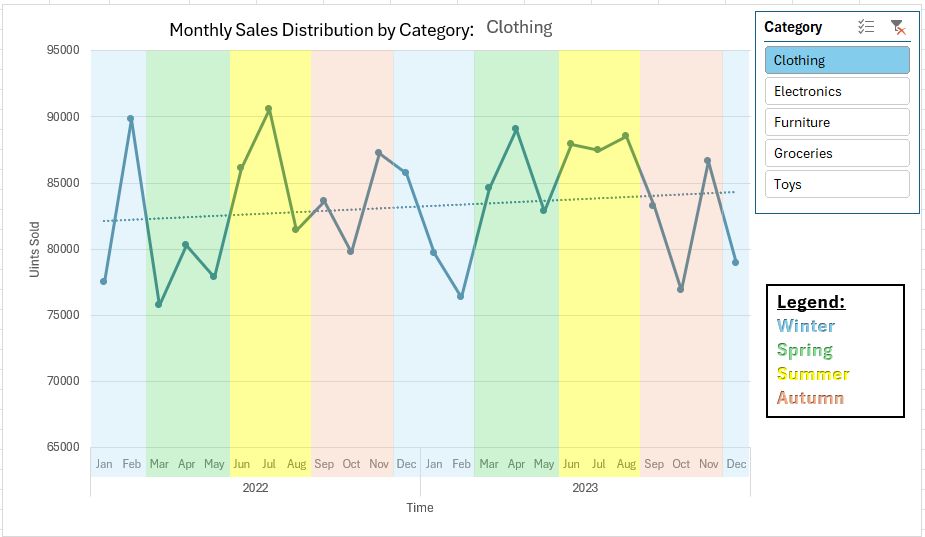

# Retail Store Analysis

## Overview
This repository demonstrates advanced Excel skills including data manipulation, pivot tables, chart creation, and regression analysis. The focus is on analyzing monthly sales distribution by category, assessing the impact of seasonality on sales, and understanding how weather conditions influence sales percentages.

## Data Source
This analysis uses the "Retail Store Inventory Forecasting Dataset" provided by Anirudh Singh Chauhan on Kaggle. This synthetic dataset is designed for practicing inventory management and demand forecasting, featuring over 73,000 rows of data across multiple stores and products.
- **Dataset Link**: [Kaggle Dataset](https://www.kaggle.com/datasets/anirudhchauhan/retail-store-inventory-forecasting-dataset)

## Graphs Overview
### 1. Monthly Sales Distribution by Category

- **Description**: Tracks monthly sales of the various categories (furnitures, groceries, toys, clothing and electronics) throughout 2022 and 2023, highlighted with seasonal background colors.
- **Insights**: Identifies peak sales periods and the impact of seasonal promotions.

### 2. Seasonality Impact on Units Sold

- **Description**: Displays seasonal variation in total unit sales with a focus on percentage changes between seasons.
- **Insights**: Highlights significant seasonal sales fluctuations, with strategic implications for inventory management.

### 3. Seasonal Distribution of Sales Percentages by Weather Condition

- **Description**: Analyzes how different weather conditions affect sales percentages across seasons.
- **Insights**: Provides insights into consumer buying behavior during various weather conditions.

## Conclusion:
Analyzing the monthly sales distribution across various retail categories reveals distinct seasonal influences and purchasing patterns. Clothing and Toys exhibit significant peaks during seasonal transitions and holidays, suggesting a strong influence of consumer behavior driven by school vacations and festive shopping. Conversely, Electronics sales remain relatively stable, possibly due to less seasonality in purchasing habits and consistent year-round demand. Furniture sales show spikes in late spring and before winter, reflecting times of home renewal and holiday preparations. The overall increase in winter sales across all categories underscores the impact of holiday shopping, while the minimal variation in sales with changing weather conditions suggests that promotions and seasonal events play a more critical role than weather itself. Effective marketing and inventory strategies should therefore be tailored to anticipate these seasonal highs and lows to optimize sales and customer engagement.

## Acknowledgements
Data provided by Anirudh Singh Chauhan from Kaggle under CC0: Public Domain license. The dataset is a synthetic representation used for educational purposes.

---

Feel free to explore the charts and data, and use this analysis as a reference for developing similar data-driven business strategies.
